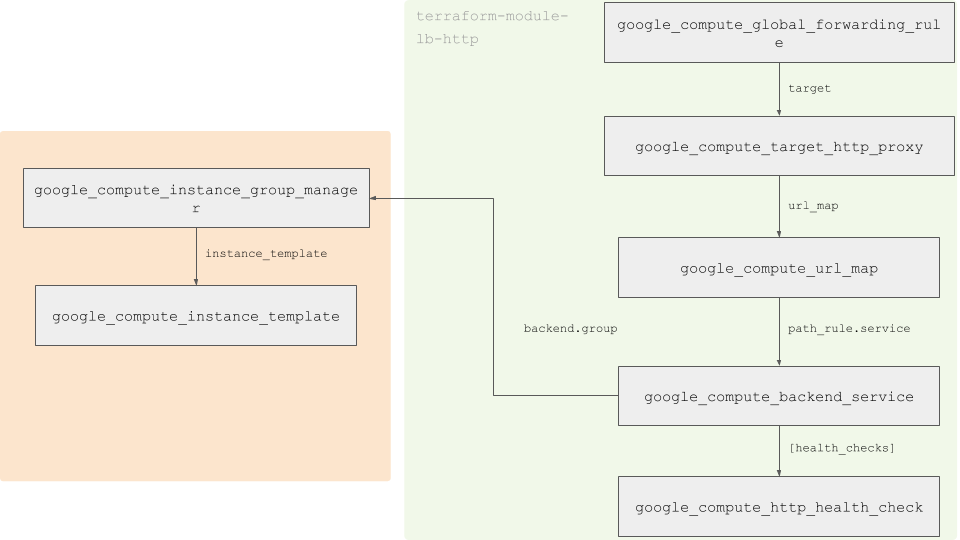

gce loadbalancer http



[a-comprehensive-guide-to-managing-secrets-in-your-terraform-code](https://blog.gruntwork.io/a-comprehensive-guide-to-managing-secrets-in-your-terraform-code-1d586955ace1)

* Pre-requisite #1: Don’t Store Secrets in Plain Text
* Pre-requisite #2: Keep Your Terraform State Secure
* Technique #1: Environment Variables
* Technique #2: Encrypted Files (e.g., KMS, PGP, SOPS)
* Technique #3: Secret Stores (e.g., Vault, AWS Secrets manager)

Check the progress of the instance creation:
```bash
gcloud compute instances get-serial-port-output [INSTANCE_NAME] --zone [ZONE_NAME]
```

Stress CPU
```bash
gcloud compute ssh --zone [ZONE_NAME] [INSTANCE_NAME] -- dd if=/dev/zero of=/dev/null 
```

Check the status of the managed instance group 
```bash
watch -n 5 gcloud compute instance-groups list
```

Simulate failure
```bash
gcloud compute ssh [INSTANCE_NAME]
supervisorctl stop pythonapp
```

Encrypt password
```
gcloud kms encrypt --plaintext-file=password.txt --key=bookshelf-key --keyring=bookshelf-key --location=global --ciphertext-file=ciphertext.txt